# Raspberry pi zero w

## 烧录完系统

开启SSH

在boot分区新建空白的 `SSH` 文件，以及 wifi 配置文件 `wpa_supplicant.conf`

```shell
ctrl_interface=DIR=/var/run/wpa_supplicant GROUP=netdev
update_config=1
country=CN

network={
     ssid="TP-LINK-DO"
     psk="********"
     key_mgmt=WPA-PSK
}
```

重启

## 查看IP

`arp -i bridge100 -a`

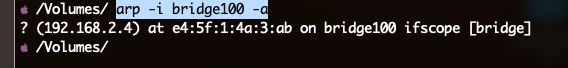

## 更改GPU大小

`sudo raspi-config`

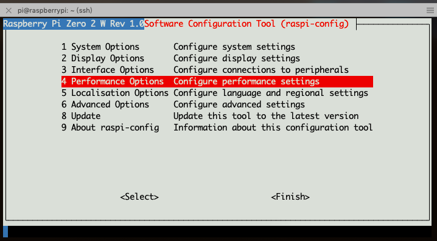

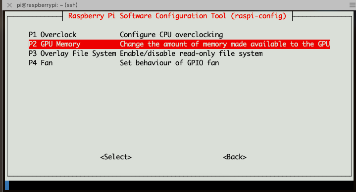

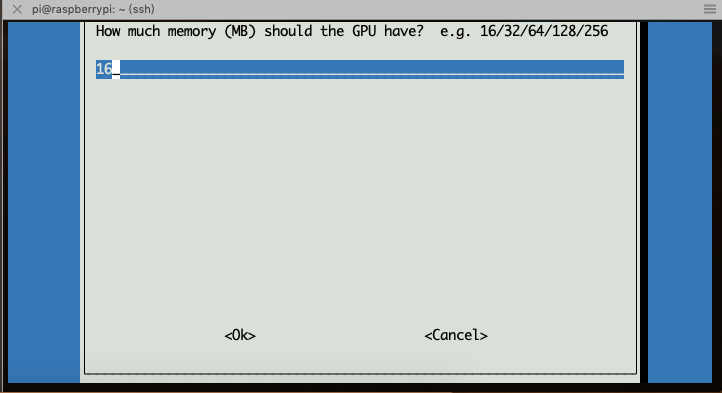

## expand filesystem

Ensure that all of the SD card is available

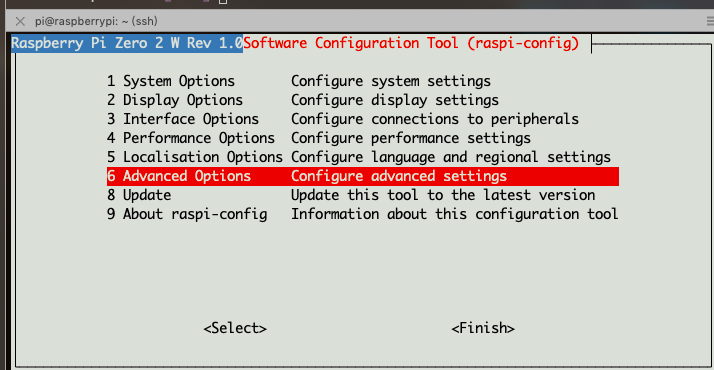

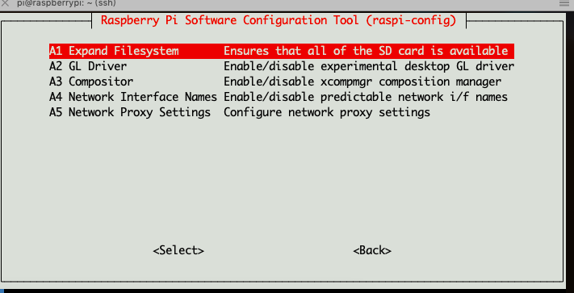

## enable ssh root login

`sudo vim /etc/ssh/sshd_config`

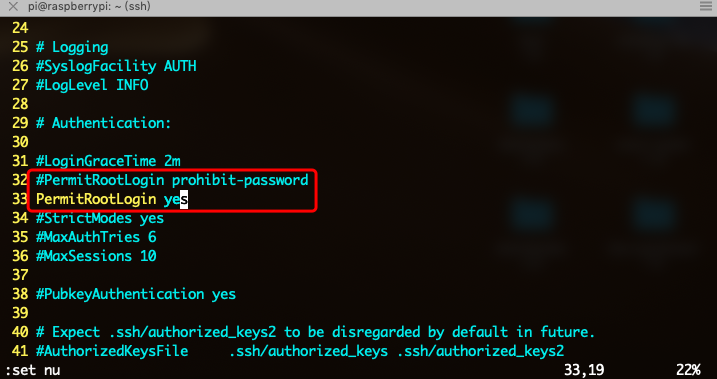

重启ssh

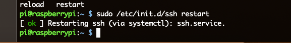

生效

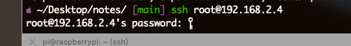

修改 root 密码

`sudo passwd root`

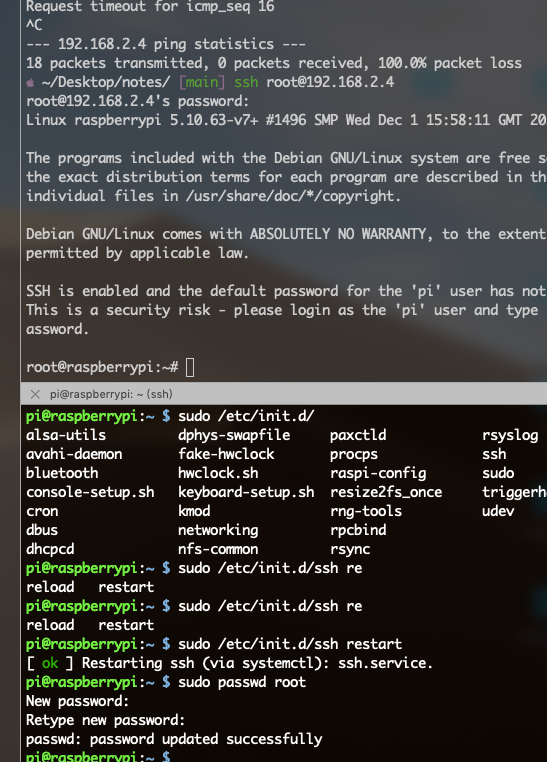

## zsh

you have to install zsh to replace bash

```shell
sudo apt-get install zsh

# Then set zsh as default shell
chsh -s /bin/zsh

sudo apt-get install git wget -y

sh -c "$(wget -O- https://raw.githubusercontent.com/ohmyzsh/ohmyzsh/master/tools/install.sh)"
```

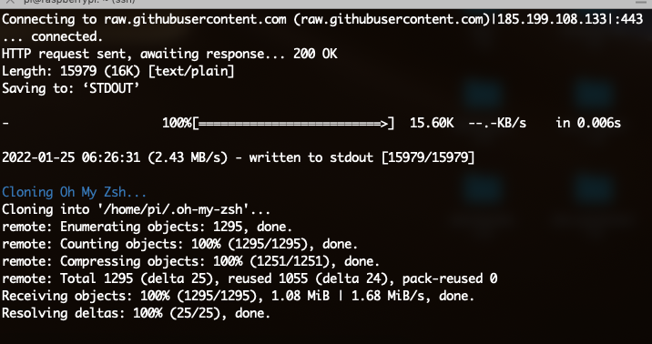

install plugins

`git clone git://github.com/zsh-users/zsh-autosuggestions $ZSH_CUSTOM/plugins/zsh-autosuggestions`

`git clone https://github.com/zsh-users/zsh-syntax-highlighting.git ${ZSH_CUSTOM:-~/.oh-my-zsh/custom}/plugins/zsh-syntax-highlighting`

```shell
vim ~/.zshrc
plugins=(git)
```

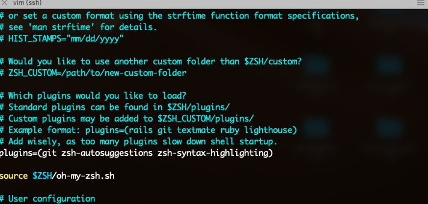

`source ~/.zshrc`

生效

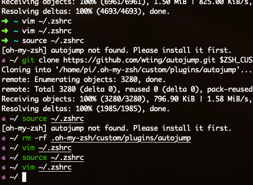

主题`ZSH_THEME="apple"`

## neofetch

`sudo apt-get install neofetch`

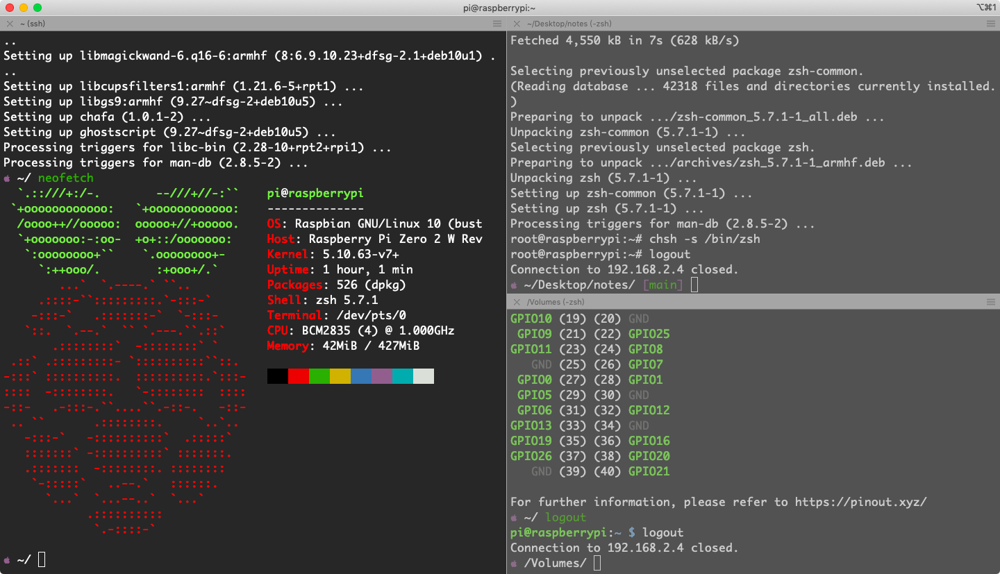

## pi dashboard

```shell
sudo apt-get update
sudo apt-get install nginx php7.3-fpm php7.3-cli php7.3-curl php7.3-gd php7.3-cgi
sudo service nginsx start
sudo service php7.3-fpm restart
```

让 nginx 处理 php

`sudo vim /etc/nginx/sites-available/default`

替换

```
location / {
  # First attempt to serve request as file, then
  # as directory, then fall back to displaying a 404.
  try_files $uri $uri/ =404;
}
```

成

```
location / {
	index  index.html index.htm index.php default.html default.htm default.php;
	autoindex on;
	autoindex_exact_size on;
	autolocaltime on;
}
 
location ~\.php$ {
  fastcgi_pass unix:/run/php/php7.3-fpm.sock;
  #fastcgi_pass 127.0.0.1:9000;
  fastcgi_param SCRIPT_FILENAME $document_root$fastcgi_script_name;
  include fastcgi_params;
}
```

重启 nginx 服务

`sudo nginx -s relad`

安装配置MySQL

`sudo apt-get install mariadb-server`

更改密码

```shell
MariaDB [(none)]> use mysql;
MariaDB [mysql]> update user set plugin="mysql_native_password" where user="root";
MariaDB [mysql]> update user set password=PASSWORD("1225") where user="root";
MariaDB [mysql]> flush privileges;
MariaDB [mysql]> exit;
```

重启服务

`sudo service mysql restart`

```
sudo git clone https://github.com/nxez/pi-dashboard.git
```

