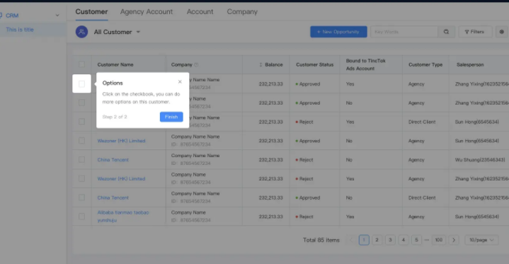

## 功能描述

## 蒙层

顾名思义，蒙层引导是指在产品上用一个半透明的黑色进行遮罩，蒙层上方对界面进行高亮，旁边配以弹窗进行讲解。这种引导方式阻断了用户与界面的交互，让用户的注意力聚焦在所圈注的功能点上，不被其他元素所干扰。

### 蒙层实现

> 蒙层很好实现，就是一个撑满屏幕的 `div`，但是我们怎么才能让它做到高亮出中间的 `selector` 元素并且还支持圆角呢？ ，真相只有一个，那就是 `border-width`。我们拿到了需要的高亮的元素的 `offsetTop`, `offsetRight`, `offsetBottom`, `offsetLeft`，并相应地设置为高亮框的border-width，再把border-color设置为灰色，一个带有高亮框的蒙层就实现啦！在给这个高亮框 `div` 加个 `pseudo-element ::after` 来赋予它 `border-radius`，完美！

